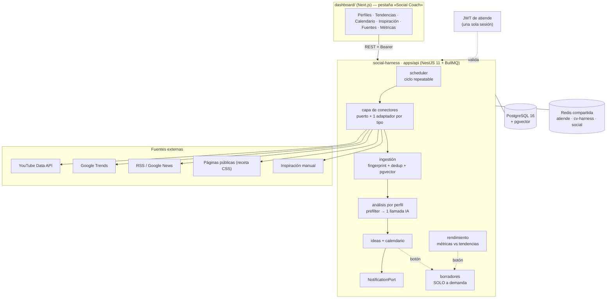
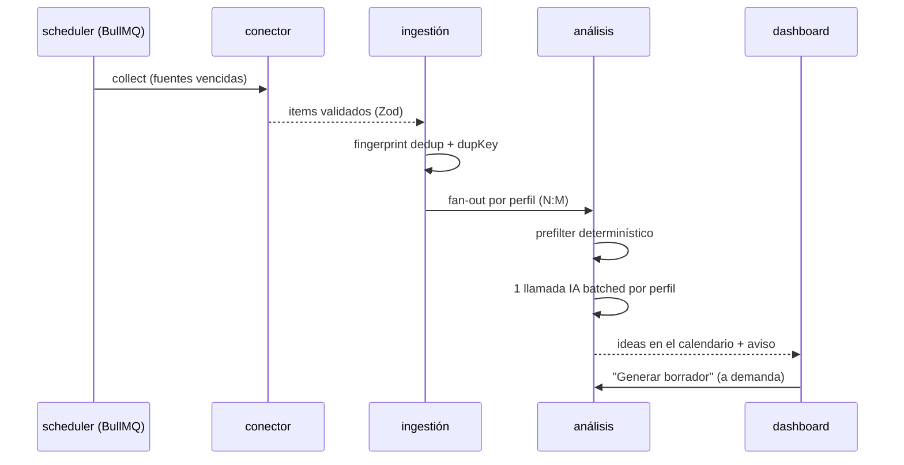

# Social Harness — coach de redes sociales con IA

Harness **event-driven** que ayuda a crecer perfiles en **Instagram, TikTok, YouTube y LinkedIn**:
recolecta **señales de tendencia**, las evalúa contra los objetivos de cada perfil y devuelve
**sugerencias** — ideas, calendario, formato/timing/hashtags y borradores — todo dentro del
dashboard. **La IA nunca publica: tú decides y publicas.**

Tercer harness de un ecosistema de proyectos personales en producción, hermano de
[`atiende`](https://github.com/Artag-Chris/atiende) (agente conversacional) y `cv-harness`
(búsqueda de trabajo con IA). Comparte su infraestructura, su forma de desplegarse y su
pestaña dentro del mismo dashboard.

---

## El problema

Publicar "a ver qué pasa" no crece una cuenta. Lo que crece es publicar lo que **ya está
funcionando en el nicho**, en el formato correcto y en el momento correcto — y eso hoy se
resuelve a mano: revisando tendencias, comparando métricas, adivinando. Este harness hace ese
trabajo: mira las tendencias, las compara con tus objetivos y te deja ideas concretas en un
calendario. Tú decides cuál publicar y la pieza sale escrita.

Dos decisiones de producto que explican casi todo el diseño:

1. **El humano está en el medio.** Una cuenta que postea sola deja de parecer humana, que es
   justo lo contrario del objetivo. El harness **no publica** y **no genera borradores** sin que
   se lo pidas: los automatismos son explícitos y apagables (`AUTO_IDEAS_ENABLED`).
2. **El costo de IA es un requisito, no un detalle.** Un ciclo mide antes de gastar: prefilter
   determinístico (gratis) → **una sola** llamada de IA por perfil (no una por señal) → frenos por
   perfil. Todo consumo queda registrado y visible.

## Qué hace

- **Perfiles múltiples** (persona/marca) con sus cuentas en las tres redes y sus **objetivos
  medibles** (seguidores, engagement, alcance, frecuencia, leads).
- **Señales de tendencia** de cinco tipos de fuente, todas configurables desde la UI:
  YouTube Data API, Google Trends, RSS/Google News, recetas CSS sobre páginas públicas y
  **inspiración pegada a mano** (lo que no se puede automatizar entra igual, por el mismo pipeline).
- **Relevancia por perfil**: la misma tendencia puede ser oro para un perfil y ruido para otro
  (`ProfileSignal` N:M, con score y razones explicables).
- **Ideas + calendario**: qué publicar, en qué formato, con qué hook, qué hashtags y **cuándo** —
  cada idea dice *por qué ahora*, atada a las señales que la dispararon.
- **Borradores a demanda**: caption o guion para copiar/exportar. Se generan solo si oprimes el botón.
- **Análisis de rendimiento**: cargas tus métricas (una a una o por CSV) y el coach te dice qué
  funcionó, qué no y qué ajustar.
- **Bandeja de avisos** en el dashboard, detrás de un puerto para sumar WhatsApp/Discord después.
- **Medidor de gasto**: cada llamada de IA queda registrada (`CoachRun`) y consultable.

## Arquitectura



### Pipeline



El detalle de cada etapa (colas, gates de costo, puntos de falla y recuperación) está en
[`docs/event-flow.md`](docs/event-flow.md).

## Decisiones de diseño

| Decisión | Por qué |
|---|---|
| **Puerto + un adaptador por tipo de fuente** | Sumar una fuente es registrar un adaptador y configurar una fila; no se integra cada portal con código ni se guardan secretos en la base. |
| **Sin navegador logueado ni scraping de Instagram/TikTok/LinkedIn** | Sus ToS lo prohíben y el anti-bot lo hace inviable. Lo no automatizable entra por la pestaña de inspiración, por el **mismo** pipeline. |
| **Sin worker Rust / sin Redis Streams** (a diferencia de cv-harness) | Acá no hay una segunda lengua al otro lado: todo el pipeline es BullMQ. Si algún día entra un conector externo, el contrato de ingestión ya lo admite. |
| **Dedup no destructivo** | `fingerprint` (URL canónica) + `dupKey` de contenido: el duplicado se **marca y se oculta**, nunca se borra, y hay botón «No es duplicado». |
| **Costo acotado por diseño** | Prefilter gratis, IA batched por perfil, umbral de relevancia, `IDEAS_PER_WEEK`, y las acciones caras (borrador, reporte) solo por botón. |
| **Multiusuario desde el día 1** | El perfil sella `ownerId`/`businessId` del JWT de atiende; todo lo demás se filtra por relación. (En cv-harness esto quedó documentado y sin implementar.) |
| **La IA detrás de un puerto, con adaptador por proveedor** | El pipeline pide `json()`/`chat()` a un puerto y nunca nombra a DeepSeek. Hay respaldo automático, y `mock` devuelve `null` en vez de datos inventados para que "sin llaves" no se confunda con "funcionando". |
| **Nada se publica automáticamente** | No hay integración de publicación en v1; el diseño del `PublishPort` está documentado y apagado a propósito ([ADR-003](docs/adr-003-notificaciones-y-publicacion.md)). |
| **Redes y formatos como catálogo, no como enum de la base** | Agregar o quitar una red es una entrada en `modules/platforms/platforms.catalog.ts` (y borrar/crear la cuenta del perfil), sin migración ni cambio en el front, que se arma desde `GET /platforms`. Además se valida que el formato exista **en esa red** ([ADR-005](docs/adr-005-redes-y-formatos-como-catalogo.md)). |
| **Métricas manuales primero** | No se bloquea el MVP detrás del trámite de apps y tokens de Meta/TikTok; el contrato ya está listo para los conectores oficiales ([ADR-002](docs/adr-002-metricas-api-oficial.md)). |

ADRs: [001 arquitectura](docs/adr-001-arquitectura.md) ·
[002 métricas por API oficial](docs/adr-002-metricas-api-oficial.md) ·
[003 notificaciones y publicación](docs/adr-003-notificaciones-y-publicacion.md) ·
[004 proveedores de IA](docs/adr-004-proveedores-de-ia.md) ·
[005 redes y formatos como catálogo](docs/adr-005-redes-y-formatos-como-catalogo.md).

## Stack

| Capa | Tecnología |
|---|---|
| API / orquestación | NestJS 11, TypeScript 5, Zod (env fail-fast), Swagger |
| Pipeline | BullMQ sobre **Redis compartida** (`QUEUE_PREFIX=socialharness`) |
| Datos | PostgreSQL 16 + **pgvector** (similitud de señales), Prisma 6 |
| IA | **Un puerto + un adaptador por proveedor** (`OpenAiCompatibleProvider` como base compartida): DeepSeek principal, Groq de respaldo, `mock` determinístico. Cambiar de proveedor es configuración |
| Embeddings | OpenAI `text-embedding-3-small` (1536) con modo mock |
| Front | Pestaña dentro del `dashboard/` existente (Next.js 16, Tailwind v4) |
| Deploy | Docker Compose sobre la infra del server, migraciones y seed automáticos en el boot |

## Infra compartida y puertos

Los tres harness conviven en la misma máquina y en el mismo server, así que cada recurso está
asignado para no chocar. **En el server este harness no crea base ni Redis**: usa los que ya corren.

| Recurso | atiende | cv-harness | **social-harness** |
|---|---|---|---|
| Postgres (server) | contenedor `atiende-postgres`, DB `atiende` | mismo contenedor, DB `cvharness` | **mismo contenedor, DB `socialharness`** (se crea sola al boot) |
| Postgres (local) | `atiende-postgres` : 5433 | `cvharness-postgres` : 5434 | **`socialharness-postgres` : 5435** |
| Redis | `redis:6379` (compartida) | `redis:6379` (compartida) | **`redis:6379` (la misma, prefijo propio)** |
| Prefijo de colas | `atiende:dev:queue` | `cvharness` | **`socialharness`** |
| API en el host | 3013 | 3100 | **3200** |
| Fixture E2E | — | 8090 | **8091** |
| Dashboard | 3001 (el mismo para los tres) | — | — |

Las llaves de Redis se aíslan por `QUEUE_PREFIX` (`socialharness:collect:…` nunca pisa
`cvharness:…` ni `atiende:dev:queue:…`), y cada proyecto tiene su propia **base** dentro del mismo
Postgres. Lo único que este harness publica al host es su API: si el 3200 estuviera ocupado en el
server, se cambia `API_PORT` en el `.env` y listo — no hay que tocar código ni compose.

## Cambiar de proveedor de IA

DeepSeek es el principal (el mismo que ya usan `atiende` y `cv-harness`), Groq el respaldo, y hay un
modo `mock` determinístico para correr todo sin llaves.

```bash
# Qué quedó resuelto y si la llave/modelo funcionan de verdad (hace 1 llamada mínima).
# En docker toma el .env de la raíz (el que se copia al server):
docker compose exec api npm run llm:check
# Fuera de docker necesita apps/api/.env (ver apps/api/.env.example).
```

Para cambiar de proveedor:

1. Si habla el dialecto OpenAI, alcanza con **configurar**: `LLM_PROVIDER`, las llaves y (si aplica)
   `*_BASE_URL`.
2. Si es otro dialecto, se agrega un adaptador en `apps/api/src/modules/llm/<proveedor>/` que cumpla
   el puerto. DeepSeek y Groq comparten `OpenAiCompatibleProvider`, que ya resuelve timeout,
   reintentos con backoff, modo JSON (con reintento si el modelo no lo soporta) y validación con Zod.
3. Registrarlo en `llm.factory.ts`: el `switch` cierra con `never`, así que **si te olvidás, no compila**.
4. `LLM_FALLBACK` define el respaldo (`auto` = el otro proveedor con llave).

Nada del pipeline se toca: los servicios inyectan `LLM_PROVIDER_TOKEN`. Detalle y evidencia medida en
[ADR-004](docs/adr-004-proveedores-de-ia.md).

## Cómo correrlo

### Local (postgres propio + Redis compartida)

```bash
# 1. Red compartida y Redis compartida (solo si no existen ya en la máquina).
#    El contenedor `redis` lo comparten los tres proyectos: no se duplica.
docker network create microservices-network
docker run -d --name redis --network microservices-network redis:7-alpine

# 2. Entorno
cp .env.example .env

# 3. Stack local (levanta SOLO su postgres en 5435) + fixture E2E
npm run docker:up:local

# 4. Estado
npm run docker:ps
docker compose logs -f api
```

- API: `http://localhost:3200/api` · Swagger: `http://localhost:3200/api/docs`
- Health: `http://localhost:3200/api/health`
- Fixture E2E: `http://localhost:8091` (solo con `--profile fixture`)

### Server

```bash
cp .env.example .env      # completar el checklist del propio archivo
docker compose up -d      # SOLO el api: usa la Redis y el Postgres que ya corren
```

En el boot el contenedor **crea la base y la extensión `pgvector` si faltan**
(`prisma/ensure-database.ts`), aplica migraciones y corre el seed **idempotente**. No hay pasos
manuales de aprovisionamiento. El `JWT_SECRET` debe ser **el mismo de atiende**: es lo que hace
que la pestaña funcione sin un segundo login.

Antes de levantarlo, esto es lo que hay que confirmar en el server (5 comandos):

```bash
# 1. ¿Está libre el puerto 3200? (lo único que este harness publica)
docker ps --format '{{.Names}}\t{{.Ports}}' | sort

# 2. El Postgres compartido y sus bases (debe estar el de atiende)
docker exec atiende-postgres psql -U atiende -c '\l'

# 3. La Redis compartida
docker exec redis redis-cli ping          # → PONG

# 4. El JWT_SECRET tiene que ser el MISMO de atiende
docker exec <contenedor-atiende> printenv JWT_SECRET
grep '^JWT_SECRET=' social-harness/.env   # debe coincidir

# 5. Levantar y mirar el boot
cd social-harness && docker compose up -d && docker compose logs -f api
#   Esperado: base "socialharness" creada · migración aplicada · seed · escuchando
```

### Verificación

```bash
cd apps/api
npm run check        # tsc --noEmit + vitest
npm run build        # nest build
npm run llm:check    # proveedores de IA contra la API real (1 llamada mínima)
```

## API

Guard global: **Bearer con el JWT de atiende** (`sub`/`businessId`/`role`); sin login propio.
Hoy ya están `GET /api/health`, `GET /api/platforms`, `GET /api/config`, los perfiles con sus cuentas
y objetivos, el catálogo de fuentes con su verificación (`POST /sources/probe`) y Swagger. El resto del
contrato, por fase:

> El detalle de **qué funciona hoy y cómo probarlo** está en [`docs/IMPLEMENTADO.md`](docs/IMPLEMENTADO.md).

| Grupo | Endpoints |
|---|---|
| Catálogo | `GET /platforms` (redes y formatos; la UI se arma desde acá) |
| Perfiles y cuentas | `GET/POST/PATCH/DELETE /profiles`, `GET /profiles/:id`, `PUT /profiles/:id/sources`, `PATCH /profiles/:id/schedule`, `POST /profiles/:id/run` (recolectar ahora), `POST /profiles/:id/ideas` (ideas a demanda), `…/accounts`, `…/objectives` |
| Fuentes | `GET/POST/PATCH/DELETE /sources`, `GET /sources/templates`, `POST /sources/probe` |
| Señales | `GET /signals` (plataforma, tipo, perfil, relevancia, fechas, duplicados), `GET /signals/:id`, `POST /signals/from-text`, `POST /signals/from-url` |
| Ideas / calendario | `GET/POST /ideas`, `PATCH/DELETE /ideas/:id`, `POST /ideas/:id/draft`, `PATCH /drafts/:id`, `POST /ideas/:id/published` |
| Métricas | `GET/POST /accounts/:id/metrics` (individual o CSV), `GET /profiles/:id/performance`, `POST /profiles/:id/performance/run` |
| Operación | `GET /notifications`, `PATCH /notifications/:id/read`, `GET /usage`, `GET /config` |

## Estructura

```
social-harness/
├── docker-compose.yml          # server: SOLO el api (infra ya corre en el server)
├── docker-compose.infra.yml    # dev local: postgres pgvector + redis + fixture
├── fixtures/www/               # RSS y HTML falsos para el E2E (profile "fixture")
├── docs/                       # ADRs, flujo de eventos, handoff de sesión
└── apps/api/
    ├── prisma/                 # schema, ensure-database (DB + pgvector), seed idempotente
    └── src/
        ├── config/             # env validado, feature flags, colas
        ├── common/             # logger JSON
        └── modules/            # health, connectors (puerto + adaptadores), …
```

## Roadmap

| Fase | Contenido | Estado |
|---|---|---|
| 0 | Esqueleto: repo, compose, schema, `ensure-database`, seed, ADRs y docs | **hecho** |
| 1 | Auth con JWT de atiende + CRUD de perfiles/cuentas/objetivos + catálogo de fuentes con `probe` | **hecho** |
| 2 | Conectores (YouTube, Google Trends, RSS, página pública, manual) + ingestión/dedup | pendiente |
| 3 | Análisis de relevancia + ideas y calendario + avisos | pendiente |
| 4 | Borradores a demanda + registro de publicado + métricas y reporte de rendimiento | pendiente |
| 5 | Pestaña «Social Coach» en el dashboard | pendiente |
| 6 | Verificación E2E en el server + publicación de canal de avisos | pendiente |

## Aviso sobre los términos de uso

El harness **no** automatiza sesiones iniciadas ni saltea bloqueos: usa APIs oficiales, feeds
públicos y páginas públicas con política de cortesía (`respectRobots`, límites de página y delay
configurables). Para lo que no se puede automatizar, la vía prevista es cargarlo a mano, no
forzarlo.
